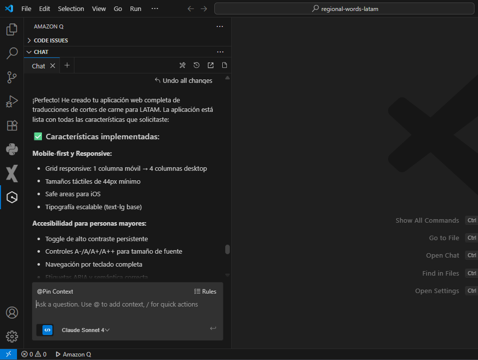

# 🥩 Traducciones LATAM - Cortes de Carne

<div align="center">
  
  
  **Desarrollado completamente con Amazon Q Developer**
</div>

---

Una aplicación web **mobile-first** y **accesible** que traduce nombres de cortes de carne entre países de Latinoamérica. Diseñada especialmente para personas mayores con características de accesibilidad avanzadas.

## 🌟 Características Principales

### 🎯 **Funcionalidad**
- **Traducción de cortes de carne** entre 7 países de LATAM
- **Búsqueda inteligente** por nombre en cualquier idioma
- **22+ cortes diferentes** con imágenes reales
- **Banderas de países** para identificación visual

### 📱 **Mobile-First & Responsive**
- Optimizado para móviles (375-414px)
- Grid adaptativo: 1 columna móvil → 4 columnas desktop
- Botones táctiles de 44px mínimo
- Safe areas para iOS

### ♿ **Accesibilidad para Personas Mayores**
- **Controles de tamaño de fuente** (A-, A, A+, A++)
- **Modo de alto contraste** persistente
- **Navegación por teclado** completa
- **Compatible con lectores de pantalla**
- **Respeta prefers-reduced-motion**
- **Etiquetas ARIA** apropiadas

## 🌎 Países Incluidos

| País | Bandera | Código |
|------|---------|--------|
| Argentina | 🇦🇷 | AR |
| Venezuela | 🇻🇪 | VE |
| Uruguay | 🇺🇾 | UY |
| Chile | 🇨🇱 | CL |
| México | 🇲🇽 | MX |
| Colombia | 🇨🇴 | CO |
| Perú | 🇵🇪 | PE |

## 🛠️ Tecnologías

- **Next.js 14** (App Router)
- **TypeScript**
- **Tailwind CSS**
- **React Country Flag**
- **Datos locales en JSON**

## 🚀 Instalación y Uso

```bash
# Clonar repositorio
git clone https://github.com/luisandresmp/regional-words-latam.git

# Instalar dependencias
cd regional-words-latam
npm install

# Ejecutar en desarrollo
npm run dev

# Construir para producción
npm run build
```

## 📊 Objetivos Lighthouse

- **Performance**: ≥90
- **Accessibility**: ≥95
- **Mobile-first** optimizado

## 🏗️ Estructura del Proyecto

```
/app
  /globals.css
  /layout.tsx
  /page.tsx
  /about/page.tsx
/components
  TopBar.tsx
  CountrySelector.tsx
  SearchBar.tsx
  CutCard.tsx
  CutsGrid.tsx
  EmptyState.tsx
/data
  meats.json
/public/images/meats
  [22+ imágenes de cortes]
```

## 🎨 Características de Diseño

- **Alto contraste** configurable
- **Tipografía escalable** (18px base móvil)
- **Espaciado generoso** para facilitar uso
- **Iconos con texto** para claridad
- **Estados visuales claros** (hover, focus)

## 📝 Ejemplos de Traducción

| Argentina | Venezuela | Chile | México |
|-----------|-----------|-------|--------|
| Peceto | Muchacho redondo | Pollo ganso | Cuete |
| Bife de chorizo | Churrasco | Lomo liso | New York |
| Vacío | Falda | Sobrecostilla | Falda |
| Entraña | Entraña | Entraña | Arrachera |

## 🤖 Desarrollado con Amazon Q Developer

Este proyecto fue desarrollado completamente utilizando **Amazon Q Developer**, demostrando las capacidades de IA para crear aplicaciones web modernas, accesibles y funcionales.

<div align="center">
  
  <p><em>Captura real del proceso de desarrollo colaborativo con Amazon Q Developer</em></p>
</div>

**Cómo Amazon Q Developer ayudó en este proyecto:**

- ✅ **Arquitectura completa**: Diseño de la estructura Next.js con TypeScript
- ✅ **Componentes accesibles**: Implementación de ARIA labels y navegación por teclado
- ✅ **Responsive design**: Grid adaptativo y mobile-first approach
- ✅ **Optimización**: Configuración de Lighthouse y performance
- ✅ **Deployment**: Setup completo para GitHub Pages
- ✅ **Datos estructurados**: JSON con traducciones de 22+ cortes de carne
- ✅ **Banderas interactivas**: Integración con react-country-flag
- ✅ **Accesibilidad avanzada**: Controles de fuente y alto contraste

**Resultado**: Una aplicación completamente funcional desarrollada en una sola sesión de chat, demostrando el poder de la programación asistida por IA.

## 📄 Licencia

MIT License - Ver [LICENSE](LICENSE) para más detalles.

---

<div align="center">
  <strong>¡Perfecto para cocineros, carniceros y amantes de la carne en LATAM! 🔥</strong>
</div>